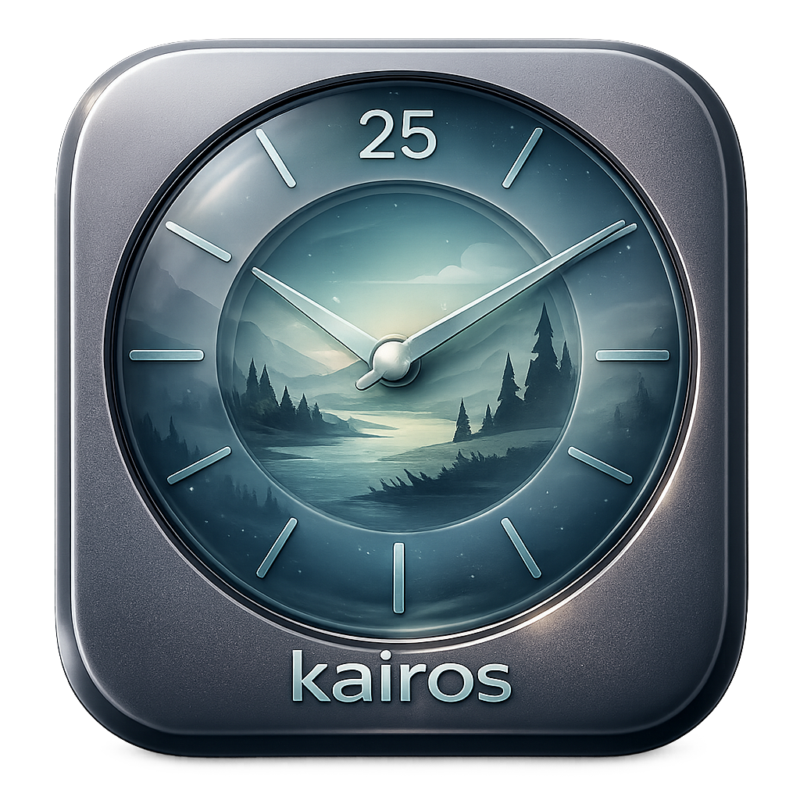

<p align="center">

<p>
 
<h1 align="center">Kairos</h1>
<!-- <p align="center">


 
</p> -->


## Overview

We all know the Pomodoro technique works wonders for beating procrastination. But honestly, most timers out there are just... annoying to use.

Kairos fixes this. It’s a clean, floating Pomodoro timer designed specifically for macOS that focuses entirely on simplicity and clean analytics.

Why you'll love it: It stays visible without getting in your way, automatically maps out your productivity trends, and doesn't hog your system resources. It’s the ultimate companion for devs, writers, and students who want to build a serious deep-work habit without the bloat.


## Features

- ⏱️ **Floating Timer** — Pin a compact always-on-top timer window so countdown progress stays visible without keeping the main window open.
- 🎯 **Focus Sessions** — Start, pause, resume, and stop focus sessions with break mode support.
- 🎨 **Theme & Opacity** — Adjustable floating window opacity and theme selection.
- 📊 **App & Website Tracking** — Monitor time spent in applications and websites (Safari, Chrome, Edge, Arc, Brave, Vivaldi, Opera, Firefox experimental).
- 📈 **Visual Analytics** — Charts showing daily/weekly activity patterns, heatmap, top apps, and top websites breakdown.


<p align="center">

</p>

## TODO

- [x] Analytics / website tracking not working yet
- [ ] Add more pomodoro styles
- [ ] Visual effect after 1 session done
- [ ] More analytics features
- [ ] Migrate from JSON to SwiftData

## Install

### Direct Download (Recomended)

1. Go to [Releases](https://github.com/farishhz/kairos/releases).
2. Download `kairos-*-mac-universal.dmg` (works on any Mac).
3. Open the DMG and drag kairos to Applications.
4. First Launch - Choose one method (recommended):
   - Option A: Right-Click Method (Easiest)
     Right-click the app -> Open -> Click Open in the dialog.
   - Option B: Terminal Method (One command, no dialogs) (recommended)
     `xattr -d com.apple.quarantine /Applications/Kairos.app`
5. macOS will show a security warning because the app is not notarized. Use one of these:
   - Recommended (one command):
     `xattr -d com.apple.quarantine /Applications/Kairos.app`
   - Or via UI:
     **System Settings > Privacy & Security > Open Anyway**.

> Note: This is an ad-hoc signed indie app. macOS shows a warning for apps not notarized through Apple's $99/year developer program. The app is completely safe and open source.

### Homebrew

```sh
brew tap farishhz/kairos
brew install --cask kairos
```

If you get an "untrusted tap" error, run:

```sh
brew trust farishhz/kairos
brew install --cask kairos
```

After install, remove the quarantine flag (unsigned app):

```sh
xattr -d com.apple.quarantine /Applications/Kairos.app
```

Update:

```sh
brew update
brew upgrade --cask kairos
```

### Permission Setup

Kairos requires several macOS permissions to function properly.

### Required Permissions

**Automation Permission:** To track browser activity

- System Settings → Privacy & Security → Automation
- Enable Kairos for your browsers (Safari, Chrome, Edge, Arc, Brave, Vivaldi, Opera, Firefox)

**System Events Permission:** For browser integration

- System Settings → Privacy & Security → Automation
- Enable Kairos for System Events

**Accessibility Permission:** For Firefox browser integration

- System Settings → Privacy & Security → Accessibility
- Enable Kairos

**Firefox Additional Setup:** Firefox does not expose tab URLs through its scripting interface, so Kairos reads the address bar via the macOS Accessibility API. This requires a one-time Firefox configuration change. Firefox website tracking is experimental and may stop working if Firefox changes its accessibility hierarchy, if the toolbar is customized, or while the browser UI is in a transient state:

- Open Firefox and navigate to `about:config`
- Accept the risk warning if prompted
- Search for `accessibility.force_disabled`
- Set the value to `-1`

**Notifications (Optional):** For session completion and update notifications

- System Settings → Notifications → Kairos
- Enable notifications as desired

### In-App Permission Prompts

The app provides helpful banners and direct links to the appropriate system preference panes when permissions are needed.

## Building from Source

```sh
git clone https://github.com/farishhz/kairos.git
cd kairos
open kairos.xcodeproj
```

Then select your scheme (Kairos) and run from Xcode (Cmd+R).

## License

This project is licensed under the BSD 3-Clause [License](LICENSE) - see the LICENSE file for details.
